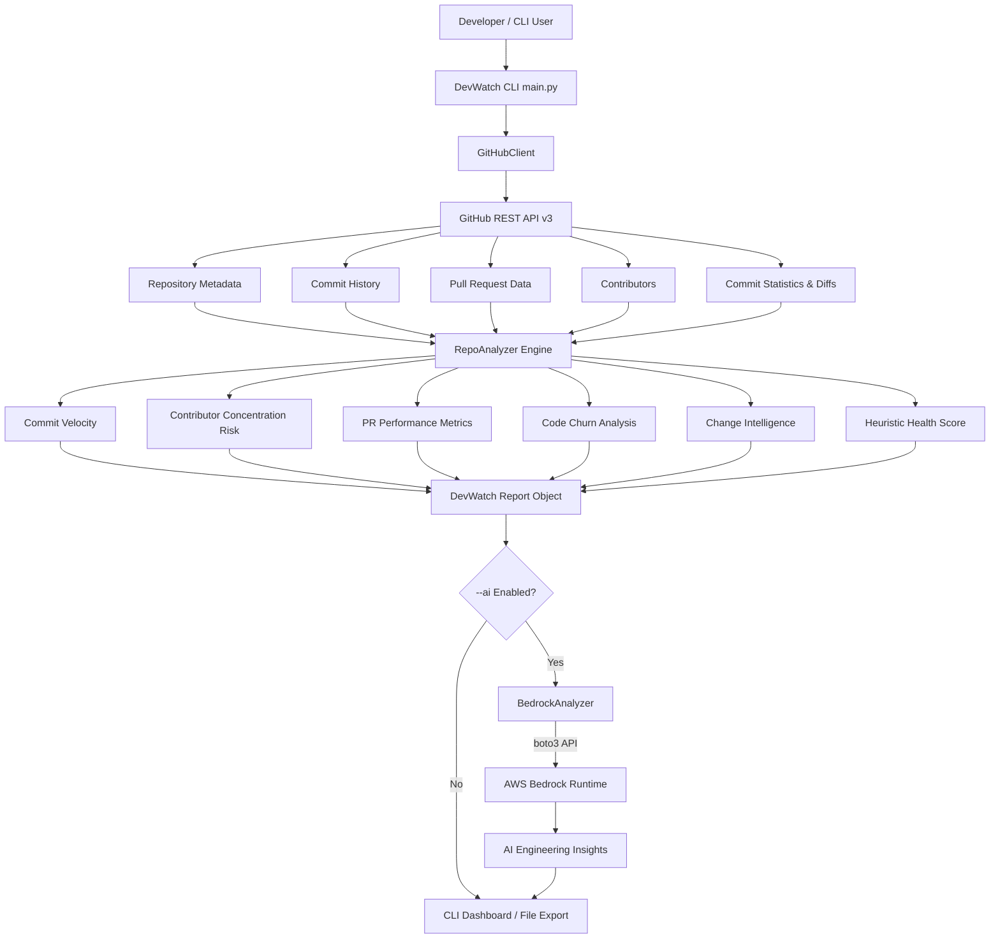

# DevWatch

GitHub Engineering Intelligence CLI

## Overview

DevWatch is a developer-focused GitHub repository intelligence CLI tool that analyzes repository activity, contributor behavior, pull-request throughput, code churn, and file-level changes to identify engineering health signals and potential development risks.

GitHub generates significant amounts of development activity data. DevWatch aggregates this raw activity and converts it into structured engineering signals for developers, maintainers, and technical reviewers.

DevWatch is designed as an engineering intelligence tool rather than a standard GitHub activity counter. It focuses on translating scalar activity numbers into actionable risk and health indicators.
<p align="center">


</p>

---

## Problem Statement

GitHub exposes individual data points including commits, pull requests, author contributions, changed files, line additions, line deletions, and repository metadata. However, these data points are presented across separate interfaces and individual view pages.

Engineering teams and maintainers reviewing a repository often need to determine:

* **Activity Status:** Is the repository actively maintained or experiencing declining velocity?
* **Velocity Trends:** What is the average daily commit rate over a given analysis window?
* **Knowledge Distribution:** Is development dependent on a single primary author?
* **PR Performance:** Are pull requests being merged effectively, and how long do merges take?
* **Codebase Focus:** Which functional areas of the codebase (such as API, Database, Frontend, or Tests) are undergoing the most change?
* **Engineering Signals:** Are there risk factors hidden inside routine repository activity?

GitHub provides the underlying activity data, while DevWatch organizes that data into a concise engineering-health view. DevWatch addresses the interpretation problem by compiling raw repository endpoints into a single evaluation report.

---

## Solution

DevWatch connects to the GitHub REST API, retrieves recent repository activity, and processes the raw payloads through a deterministic analysis engine (`RepoAnalyzer`).

The deterministic engine:
1. Calculates commit frequency and daily velocity.
2. Evaluates author commit distribution to detect contributor concentration risk.
3. Analyzes pull-request states and average resolution latency.
4. Measures code churn ratios from line additions and deletions.
5. Classifies modified file paths into engineering areas using heuristic path rules.
6. Computes a heuristic Repository Health Score from baseline metrics and risk deductions.

### Deterministic Engine vs. Optional AWS Bedrock AI Integration

DevWatch strictly separates deterministic metric calculation from optional AI analysis:

* **Deterministic Analysis Engine:** Executes locally without AI. It calculates exact numerical metrics, mathematical churn ratios, PR resolution timing, file classifications, and heuristic health deductions.
* **Optional AWS Bedrock Integration:** Takes the structured metrics produced by the deterministic engine and passes them to AWS Bedrock (`BedrockAnalyzer`) to generate higher-level engineering interpretations and maintainer recommendations.

Basic DevWatch analysis operates independently without requiring AWS Bedrock credentials.

---

## Why DevWatch?

Standard repository inspection provides scalar counts:
* *"How many commits occurred this month?"*
* *"Who authored the recent commits?"*
* *"How many files were modified?"*

DevWatch translates raw metrics into engineering questions:
* *"What is the daily velocity and activity trend of this repository?"*
* *"Is there single-contributor dependency risk?"*
* *"Which engineering domains are undergoing active modification?"*

### Operational Workflow

```
GitHub Activity Data
      │
      ▼
Commit / PR / Contributor Analysis
      │
      ▼
Code Churn Calculation
      │
      ▼
File-Level Change Intelligence
      │
      ▼
Engineering Risk Signals
      │
      ▼
Heuristic Repository Health Score
      │
      ▼
(Optional) AWS Bedrock AI Interpretation
```

### Signal Translation Example

**Raw Repository Inputs:**
* 91% of recent commits authored by 1 contributor.
* Database models and API endpoints modified.
* Test suite files modified alongside application files.
* Average PR resolution time: ~32.4 hours.

**DevWatch Output:**
* ⚠️ **Contributor Concentration Risk:** Flagged as `HIGH` (>60% single contributor share).
* 📁 **Change Intelligence:** Identifies changes in `Frontend` (27), `API` (16), `Database` (12), `Tests` (11), and `Configuration` (1).
* 📊 **Calculated Health Score:** `80.0/100 (GOOD)`.
* ⚡ **Investigation Focus:** Rebalancing ownership distribution and monitoring PR review queues.

---

## Key Features

### Repository Health

The DevWatch Health Score is a heuristic engineering-health signal designed to summarize repository activity and detected risks. It should be interpreted as an investigation aid rather than an absolute measure of software quality.

* **Score Scale:** 0 to 100 baseline.
* **Deduction Rules:** Deductions are applied when specific risk conditions are detected:
  * Contributor Concentration Risk (`HIGH` deducts 20 points, `MEDIUM` deducts 10 points).
  * Slow PR Merge Latency (>72 hours average merge time deducts 15 points).
  * Low Commit Velocity (0 commits in analysis window deducts 25 points).
  * Low PR Merge Success Rate (<50% merge rate deducts 10 points).
* **Rating Tiers:**
  * `EXCELLENT`: 85–100
  * `GOOD`: 70–84
  * `NEEDS IMPROVEMENT`: 50–69
  * `POOR`: 0–49

### Commit Activity

* Tracks total commits within the specified time window (default 30 days).
* Calculates average commit velocity per day.
* Identifies the busiest day of the week based on commit timestamp distribution.

### Contributor Intelligence

* Identifies total unique contributors in the analysis window.
* Ranks top authors by commit volume and percentage contribution share.
* **Contributor Concentration Risk (Bus-factor-style risk signal):**
  * `HIGH`: Top contributor accounts for >60% of recent commits.
  * `MEDIUM`: Top contributor accounts for >40% of recent commits.
  * `LOW`: Top contributor accounts for $\le 40\%$ of recent commits.

*High contributor concentration indicates potential ownership dependency or knowledge-distribution risk within the recent commit window.*

### Pull Request Intelligence

* Measures PR volume across states: Merged, Open, and Closed Unmerged.
* Calculates PR Merge Success Rate percentage.
* Calculates Average PR Merge Time in hours, measured from pull request creation timestamp to merge timestamp for merged PRs.

### Code Churn

* Tracks total line additions and deletions across sampled commits.
* Calculates Net Lines Changed.
* Computes Churn Ratio ($\text{Additions} / \text{Deletions}$).
* **Commit Sampling:** Detailed commit statistics are sampled (up to 15 recent commits by default) to optimize speed and reduce unnecessary GitHub API consumption.

### Change Intelligence

Change Intelligence examines modified files in sampled commits and categorizes them into engineering areas to help answer: *"Where is engineering effort currently being concentrated?"*

File categories are derived using path and filename matching heuristics:

* **Authentication:** Auth, session, security, login, permissions, JWT, OAuth, token files.
* **Dependencies:** Package manifests and lockfiles (`package.json`, `yarn.lock`, `requirements.txt`, `go.mod`, etc.).
* **API:** Controller, route, endpoint, GraphQL, and resolver files.
* **Database:** Database migrations, schemas, ORM models (`prisma`, `sequelize`, `mongoose`, `db/`, `/models/`).
* **Tests:** Unit, integration, and spec test files (`.test.`, `.spec.`, `tests/`, `__tests__/`).
* **Configuration:** Docker, environment files, CI/CD workflows, build configs (`.env`, `Dockerfile`, `.github/workflows/`, `tsconfig`).
* **Frontend:** UI components, pages, views, styles, and client scripts (`components/`, `pages/`, `.tsx`, `.jsx`).
* **Documentation:** Documentation files and Markdown guides (`README.md`, `docs/`).
* **Other:** Files not matching designated domain patterns.

Change Intelligence surfaces specific test-file activity alongside application file changes.

### Engineering Insights

Aggregates detected signals into plain-language status observations:
* Contributor concentration warnings.
* PR turnaround velocity notes.
* Activity rate observations.
* PR merge success warnings.

### Optional AWS Bedrock Integration

DevWatch optionally integrates with AWS Bedrock to generate higher-level engineering interpretations and maintainer recommendations.

The currently configured model is Amazon Nova Micro (`us.amazon.nova-micro-v1:0`), subject to AWS Bedrock model access and account quotas.

The core deterministic analysis works independently of AWS Bedrock.

### Rich CLI

* Formatted terminal dashboard powered by `rich`.
* Visual panels for repository metadata, health index, top contributor leaderboard, activity summary table, change intelligence area breakdown, and key modified files.
* Automatic UTF-8 console encoding configuration for Windows terminals.

### Report Export

* Export analysis to structured JSON (`--export json`).
* Export analysis to Markdown (`--export md`).

---

## Feature Comparison

| Capabilities | Standard GitHub Web UI | DevWatch CLI |
| :--- | :---: | :---: |
| **Activity Data** | Fragmented across web pages | Consolidated CLI view |
| **Contributor Analysis** | Commits per author count | Contributor concentration risk signal |
| **Pull Request Metrics** | Individual PR status lists | PR merge success rate & average merge latency |
| **Code Churn** | Basic diff count | Aggregate addition/deletion churn ratio |
| **File Classifications** | File tree view | Change Intelligence engineering area breakdown |
| **Health Evaluation** | Manual assessment | Heuristic Health Score & insight warnings |
| **AI Interpretation** | Not available | Optional AWS Bedrock integration |

---

## How It Works

```
User CLI Invocation
       │
       ▼
GitHubClient (Requests REST API v3)
       │
       ▼
Raw Payload (Repo, Commits, PRs, Contributors, Diff Stats)
       │
       ▼
RepoAnalyzer Engine
 ├── Commit Velocity Calculator
 ├── Contributor Concentration Risk Evaluator
 ├── PR Latency & Success Rate Engine
 ├── Code Churn & Diff Sampler
 └── Change Intelligence File Classifier
       │
       ▼
Heuristic Health Score & Insights Generator
       │
       ├─────────────────────────────────┐
       ▼                                 ▼
Standard CLI / Export            (If --ai enabled)
(JSON / Markdown Output)                 │
                                 BedrockAnalyzer (boto3)
                                         │
                                         ▼
                                 AWS Bedrock Runtime LLM
                                         │
                                         ▼
                                 AI Engineering Insights
```

---

## Architecture



---

## Example Analysis

Below is an example analysis output generated from a snapshot run on `outline/outline`:

> *Note: These values represent a live repository snapshot and will change as the target repository receives new commits and pull requests.*

```
Repository:           outline/outline
Analysis Window:      30 days
DevWatch Health:      80.0/100 (GOOD)

Commit Metrics:
  Total Commits:      100
  Commits / Day:      3.33
  Busiest Day:        Saturday

Pull Requests:
  Analyzed PRs:       50
  Merge Success Rate: 66.0%
  Avg Merge Time:     32.4 hours

Contributors:
  Unique Authors:     30
  Top Contributor:    tommoor (91.0% contribution share)
  Contributor Risk:   HIGH

Code Churn (Sampled):
  Additions:          +5,990
  Deletions:          -1,873
  Churn Ratio:        3.2

Change Intelligence (Engineering Areas):
  Other:              70
  Frontend:           27
  API:                16
  Database:           12
  Tests:              11
  Configuration:      1
```

---

## Installation

### Prerequisites

* Python 3.9 or higher
* `pip` package manager
* AWS Credentials (only required if using the `--ai` AWS Bedrock integration)

### Setup Steps

```bash
# 1. Clone the repository
git clone https://github.com/your-username/devwatch.git
cd devwatch

# 2. Install dependencies
pip install -r requirements.txt
```

---

## Configuration

DevWatch reads environment variables from a local `.env` file (loaded via `python-dotenv`) or standard system environment variables.

```env
# Optional: GitHub Personal Access Token to increase GitHub API rate limits
GITHUB_TOKEN=your_github_token_here

# Optional: AWS Region for AWS Bedrock integration
AWS_REGION=us-east-1
```

---

## CLI Usage

DevWatch can be run directly via Python CLI scripts.

### Basic Repository Analysis

```bash
# Navigate to analyzer directory
cd devwatch/analyzer

# Run analysis on a repository (defaults to 30 days)
python main.py --repo outline/outline --days 30
```

### Interactive Mode

If `--repo` is omitted in an interactive terminal session, DevWatch prompts for the repository name:

```bash
python main.py
```

### Custom Analysis Window & Exports

```bash
# Analyze over 30 days and export report to Markdown
python main.py --repo outline/outline --days 30 --export md

# Export metrics to JSON
python main.py --repo outline/outline --days 30 --export json
```

### Optional AWS Bedrock AI Insights

```bash
# Enable AWS Bedrock AI insights (uses default model us.amazon.nova-micro-v1:0)
python main.py --repo outline/outline --ai

# Specify a custom AWS Bedrock model ID
python main.py --repo outline/outline --ai --model us.amazon.nova-micro-v1:0
```

---

## Project Structure

```
devwatch/
├── analyzer/
│   ├── __init__.py      # Package initialization
│   ├── analyzer.py      # Core RepoAnalyzer engine and Change Intelligence
│   ├── bedrock.py       # BedrockAnalyzer AWS Bedrock integration client
│   ├── github.py        # GitHubClient REST API wrapper and parser
│   └── main.py          # Rich CLI entrypoint, dashboard, and report exporter
├── .gitignore           # Git exclusion rules
├── LICENSE              # MIT License
├── requirements.txt     # Python package dependencies
└── README.md            # Project documentation
```

---

## Security

* **Credential Handling:** DevWatch does not store or hardcode API keys or AWS credentials. Credentials are read from environment variables or standard AWS CLI profiles (`aws configure`).
* **Git Exclusion Rules:** The repository `.gitignore` explicitly excludes sensitive and temporary files:
  * `.env` and `*.env` files
  * Python bytecode and `__pycache__/`
  * Generated JSON and Markdown exports (`devwatch_*.json`, `devwatch_*.md`)

Never commit GitHub tokens or AWS secret keys to version control repositories.

---

## API Rate Limiting

DevWatch is designed to be rate-limit aware when communicating with the GitHub REST API v3:

* **Rate Limit Awareness:** `GitHubClient` inspects API response headers (`X-RateLimit-Remaining` and `X-RateLimit-Reset`) to handle rate limits and raise informative warnings when quota thresholds are reached.
* **API Authentication:** Providing a `GITHUB_TOKEN` environment variable authenticates API calls and grants higher GitHub API rate limit quotas.
* **Commit Sampling:** Detailed commit diff statistics are sampled (up to 15 commits per analysis run by default) rather than fetching full diffs for every historic commit, significantly reducing API quota consumption.

---

## Limitations

* **API Rate Limits:** Limits imposed by GitHub API v3 apply to analysis depth.
* **Commit Sampling:** Code churn and file classifications are derived from sampled commits, which may not capture every single file change in very large repositories.
* **Heuristic Scoring:** The DevWatch Health Score is calculated using heuristic deduction weights rather than formal software quality audits.
* **Heuristic Classification:** Change Intelligence uses filename and path matching heuristics to classify files, which may classify non-standard directory structures as `Other`.
* **Snapshot Sensitivity:** Repository health metrics represent a point-in-time snapshot over the selected analysis window and will naturally fluctuate as repository activity changes.
* **AWS Bedrock Dependence:** AWS Bedrock AI insights require active AWS credentials and model access permissions in the target AWS region.
* **AI Interpretation:** AI-generated Bedrock summaries represent qualitative evaluations and should not be treated as mathematically authoritative facts.

---

## Future Roadmap

The following features are identified as future enhancement scope and are not currently present in the implementation:

* **Historical Health Trends:** Tracking health score changes over multi-month historical windows.
* **Repository Comparison:** Side-by-side comparison of multiple GitHub repositories.
* **Dependency Impact Analysis:** Deep security vulnerability scanning for changed dependency manifests.
* **CI/CD Integration:** GitHub Actions integration to fail builds on specific risk thresholds.
* **GitHub Webhooks:** Event-driven webhook processing for real-time pull request monitoring.
* **PR Risk Prediction:** Predicting PR merge latency using historical reviewer patterns.
* **Developer Ownership Mapping:** File-level git blame ownership and bus-factor calculations.
* **Web Dashboard:** Interactive React/Vite web interface for visual repository exploration.
* **Slack / Teams Notifications:** Automated alert dispatch to team messaging platforms.

---

## Contributing

Contributions, issues, and feature requests are welcome. Please ensure that proposed changes pass syntax verification (`python -m py_compile`) and maintain the separation between deterministic analysis and optional AI interpretation.

---

## License

Distributed under the MIT License. See `LICENSE` for more information.
